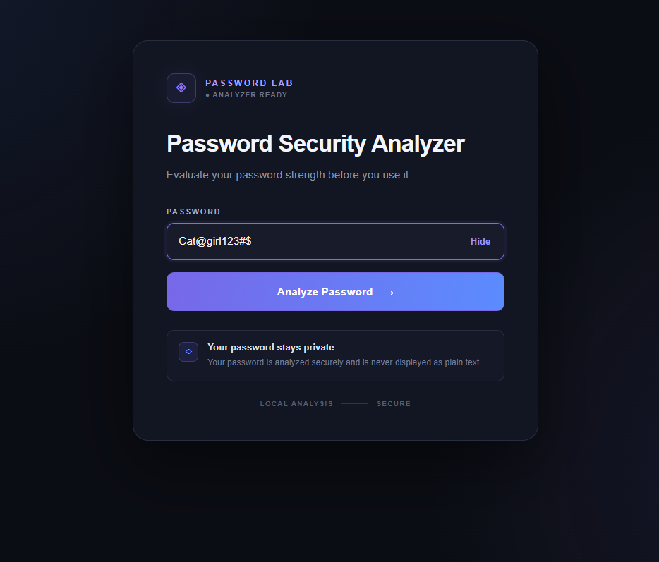
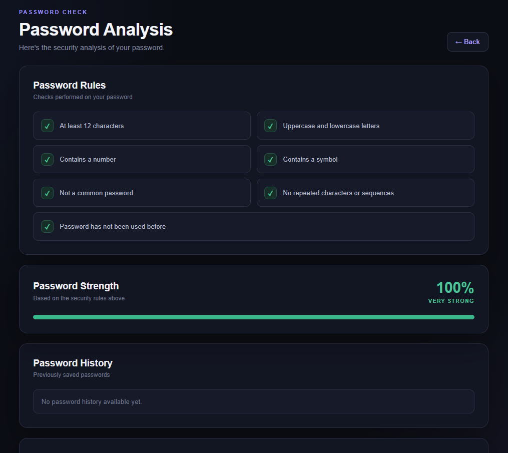
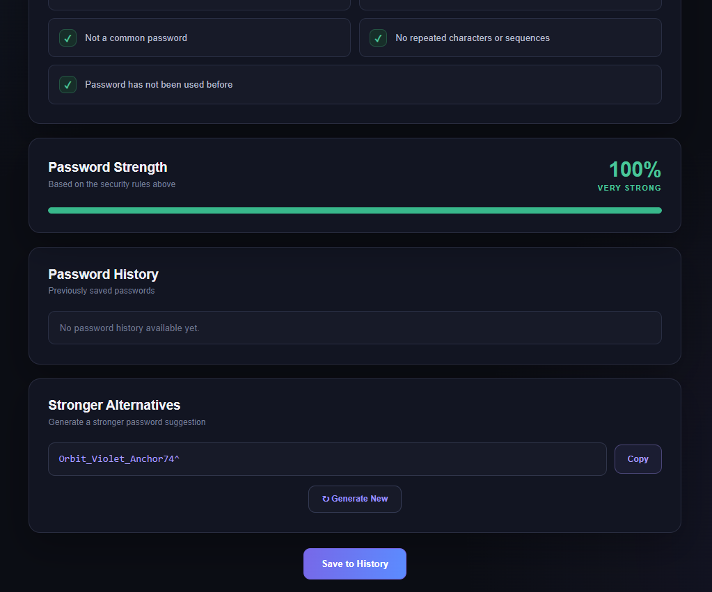

# Password Security Analyzer

A web-based password security analyzer built using Python Flask, HTML, CSS, JavaScript, and SQLite.

The application evaluates password strength using multiple security rules, detects password reuse, maintains password history, and generates stronger password alternatives.

## Features

- Password strength analysis
- Multiple password security rule checks
- Strength percentage calculation
- Weak, Fair, Strong, and Very Strong classification
- Password reuse detection
- Password history tracking
- SHA-256 hashing for stored passwords
- Stronger password generation
- Copy generated password
- Generate new password alternatives
- Responsive dark-themed interface
- SQLite database integration

## Technologies Used

- Python
- Flask
- HTML5
- CSS3
- JavaScript
- SQLite
- SHA-256

## Application Workflow

Enter Password
↓
Analyze Password
↓
Security Rule Validation
↓
Strength Calculation
↓
Password Reuse Check
↓
View Analysis
↓
Generate Stronger Alternative
↓
Save Password to History

## Screenshots

### Password Analyzer

The main interface allows users to enter a password and analyze its security strength.

### Password Security Analysis

The analysis page displays individual password security rules, password strength percentage, and password history.

### Password History and Stronger Alternatives

Users can view password history, generate a stronger password alternative, copy the generated password, and save the analyzed password to history.

## Password Security Checks

The analyzer checks the following:

- At least 12 characters
- Uppercase and lowercase letters
- Contains a number
- Contains a symbol
- Not a common password
- No repeated characters or common sequences
- Password has not been used before

## Password Strength Calculation

The application calculates a percentage based on multiple security conditions.

| Strength | Score |
|----------|-------|
| Weak | Below 50% |
| Fair | 50% - 69% |
| Strong | 70% - 84% |
| Very Strong | 85% - 100% |

## Password History

Previously saved passwords are not stored as plain text.

Instead, the application generates a SHA-256 hash and stores the hash in the SQLite database.

This allows the application to check whether a password was previously used without storing the original password.

## Project Structure

password-security-analyzer/
│
├── static/
│   └── style.css
│
├── templates/
│   ├── index.html
│   ├── result.html
│   └── saved.html
│
├── app.py
├── database.db
├── requirements.txt
└── .gitignore

## Installation

Clone the repository:

git clone https://github.com/yuvasreeb/password-security-analyzer.git

Navigate to the project folder:

cd password-security-analyzer

Install the required dependencies:

pip install -r requirements.txt

Run the application:

python app.py

Open the application in your browser:

http://127.0.0.1:5000

## Security Note

The application uses SHA-256 hashing for passwords stored in the password history database. Plain-text passwords are not stored in the password history table.

## Project Purpose

This project was developed as an internship project to demonstrate practical implementation of:

- Python Flask web development
- Frontend and backend integration
- Password security concepts
- SQLite database integration
- Password strength evaluation
- Secure password history handling
- JavaScript-based password generation
